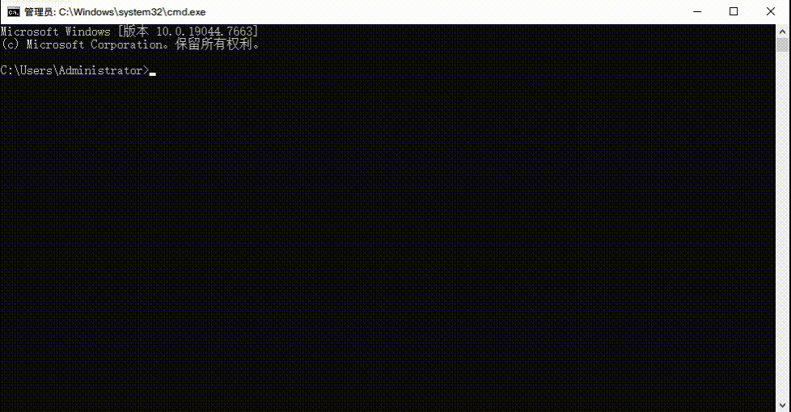

# ai

男生自用Coding Agent，参考了[nanopi教学](https://pi-from-scratch.vercel.app/)

不断学习+开发中，当前项目仍属于比nano还简陋的“bare-pi”，but one day...



## 安装

```bash
# npm
npm install @nickyzj2023/ai

# yarn
yarn add @nickyzj2023/ai

# pnpm
pnpm add @nickyzj2023/ai
```

## 使用方式

### 在项目里使用

```typescript
import { defineModel, runAgent, getWeather } from "@nickyzj2023/ai";
// MCP体积较大（200kb），有需要时单独引入
import { loadMCPTools } from "@nickyzj2023/ai/mcp";

const model = defineModel({
  baseUrl: "https://api.deepseek.com/v1",
  apiKey: process.env.APIKEY,
  model: "deepseek-v4-flash",
});

const tools = [
  // 内置工具
  getWeather,
  getTime,
  // MCP工具
  ..(await loadMCPTools({
    exa: {
			type: "streamable_http",
			url: "https://mcp.exa.ai/mcp",
			headers: {
				"x-api-key": "xxxxx",
			},
		}
  })),
  // 自定义工具
  defineTool("skipReply", "跳过本轮回复", {reason: {type: "string", description: "不回复的理由"}}, () => {
    const error = new Error(`模型保持沉默，理由：${reason}`);
		error.name = "skipReply";
		throw error;
  }),
];

const messages = [{ role: "user", content: "随机一个负无穷到正无穷的整数" }];

for await (const e of runAgent(model, messages, tools)) {
  console.log(e);
}
```

### 在终端里使用

```bash
# 首次使用：交互式配置BASE_URL / APIKEY / MODEL / ...
ai setup

# 启动对话
ai
```

配置保存在 `~/.@nickyzj2023/ai/config.json`，任意目录下执行`ai`都能读取到

## License

ISC
